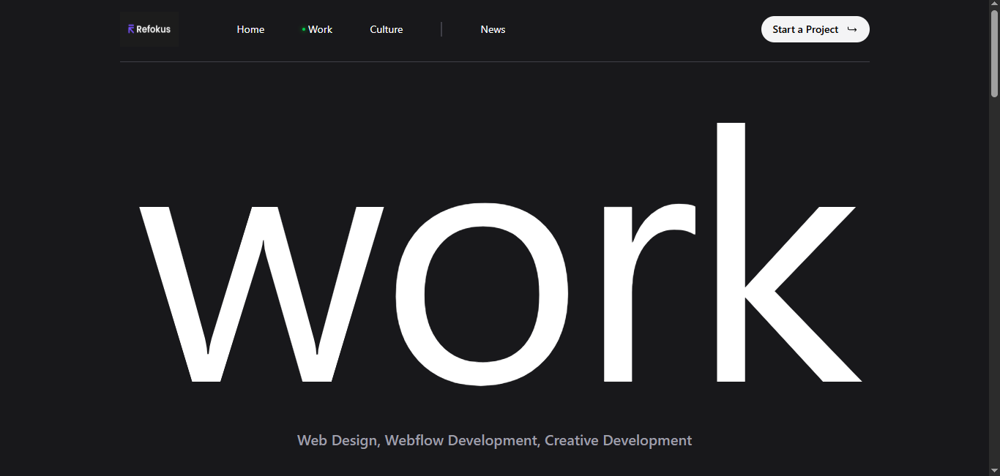

# ✨ Refokus Clone — Modern Animated Agency Website

A modern, premium, and animation-rich agency website inspired by **Refokus**, built using **React**, **Vite**, and **Framer Motion**.  
This project focuses on **smooth micro-interactions, 3D-inspired motion effects, dark theme UI, and agency-level design aesthetics**.

---

## 🚀 Features

### 🎨 UI / UX
- Clean & modern Refokus-style dark theme  
- Smooth section-based transitions  
- Minimal + premium agency design  
- Animated headings, texts, and media elements  
- Responsive layout for all devices  

### ⚡ Animations & Interactions
- Built entirely with **Framer Motion**  
- Scroll-based fade, slide, and scale animations  
- Awards marquee auto-scroll  
- Hover-based interactive elements  
- Soft 3D motion effects for depth  

### 📌 Core Sections
- Hero / Home  
- Awards Showcase  
- Projects Section  
- Footer  

---

## 🛠 Tech Stack

| Technology       | Purpose |
|------------------|---------|
| **React (Vite)** | UI development & project structure |
| **Framer Motion** | Page + element animations |
| **Tailwind CSS / CSS** | Styling & layout |
| **React Icons** | Icons used across UI |

---

## 📸 Screenshots

### 🟣 Home Section


### 🟣 Awards Section


### 🟣 Projects Section


### 🟣 Footer


---

## 📦 Getting Started

Install dependencies:

```bash
npm install
